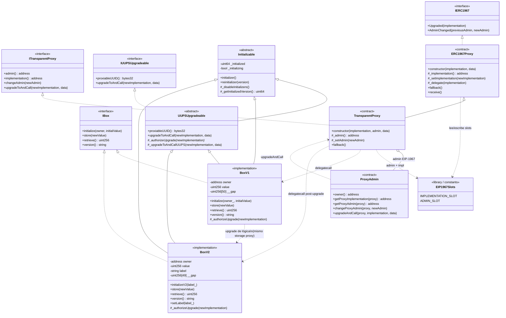

# Diagrama de clases — Upgradeable Proxies (UUPS & Transparent)

Vista estructural de contratos, interfaces y relaciones (módulo 11).

## Diagrama (Mermaid)

## Relaciones clave

| Desde | Hacia | Tipo | Motivo |
|-------|-------|------|--------|
| `ERC1967Proxy` | Implementación | Dependencia (delegatecall) | Ejecuta lógica en contexto de storage del proxy |
| `TransparentProxy` | `ProxyAdmin` | Asociación (slot admin) | Solo el admin gestiona upgrades / changeAdmin |
| `ProxyAdmin` | `TransparentProxy` | Dependencia | Llama `upgradeToAndCall` como `msg.sender == admin` |
| `BoxV1` / `BoxV2` | `UUPSUpgradeable` | Herencia | La autorización de upgrade vive en la lógica |
| `BoxV*` | `Initializable` | Herencia | Evita re-init y deshabilita constructores útiles vía proxy |
| `BoxV1` → `BoxV2` | — | Compatibilidad de layout | Variables nuevas solo al final; `__gap` reducido |

## Notas de diseño

1. **Dos caminos de upgrade**: Transparent (admin en el proxy) vs UUPS (autorización en la impl).
2. **Storage del proxy ≠ storage de la impl desplegada**: el estado vive en la dirección del proxy.
3. **`__gap`**: reserva slots en contratos base/impl para extensiones futuras sin colisión.
4. **Function clash (Transparent)**: si `msg.sender` es admin, no se hace delegatecall de selectores de usuario.
5. **OZ v5**: se puede heredar primitivas auditadas; la semántica debe cumplir EIP-1967 y los errores custom del módulo.
