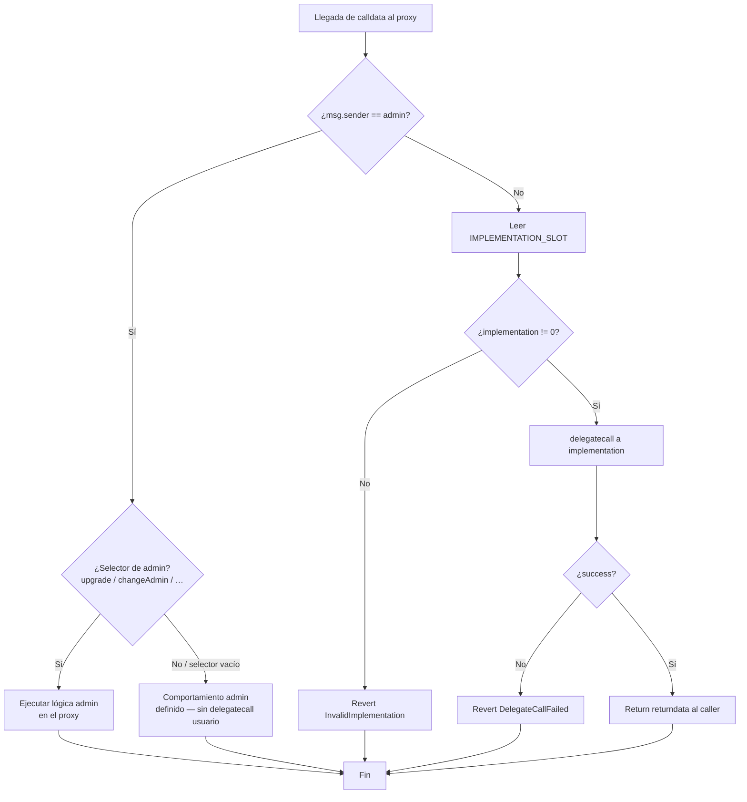
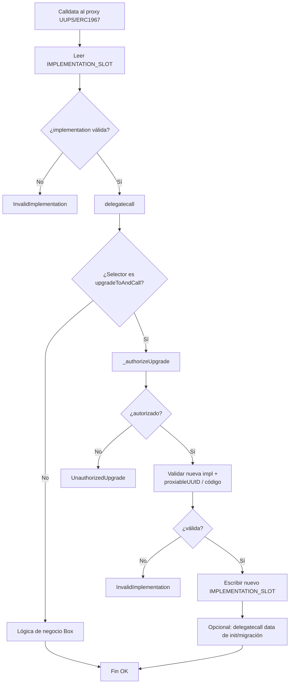
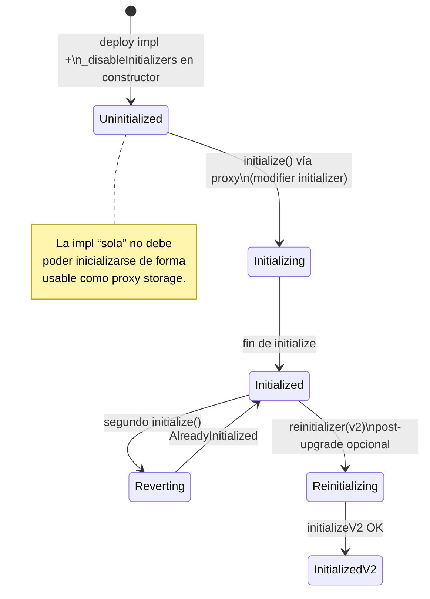
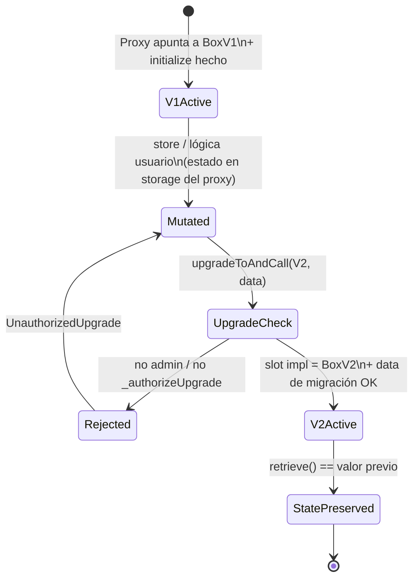

# Diagrama de flujo — Routing, inicialización y upgrade

Flujos de decisión internos del sistema de proxies (módulo 11).

## 1. Routing Transparent Proxy (fallback)

## 2. Routing UUPS (usuario siempre delegatecall)

## 3. Inicialización (`Initializable`)

## 4. Ciclo de upgrade (ambos patrones)

## 5. Tabla de decisiones / errores

| Situación | Condición | Resultado | Error |
|-----------|-----------|-----------|--------|
| Delegatecall a `address(0)` | impl inválida | revert | `InvalidImplementation` |
| `delegatecall` falla | success == false | revert | `DelegateCallFailed` |
| Re-init | `_initialized` ya set | revert | `AlreadyInitialized` |
| Upgrade sin permiso | caller no autorizado | revert | `UnauthorizedUpgrade` |
| Upgrade a impl sin código / UUID malo | check UUPS/ERC1967 | revert | `InvalidImplementation` |
| Usuario en Transparent | `msg.sender != admin` | delegatecall | — |
| Admin en Transparent | `msg.sender == admin` | path admin | — |

## Invariantes

1. El **estado de negocio** vive en la dirección del **proxy**, nunca se “mueve” al cambiar de impl.
2. Toda ejecución de lógica de usuario pasa por **`delegatecall`**.
3. Un upgrade **no** re-ejecuta `initialize` de V1; migraciones usan `reinitializer` o calldata de `upgradeToAndCall`.
4. Layout V2 **no reordena ni reutiliza** slots ya ocupados por V1.
