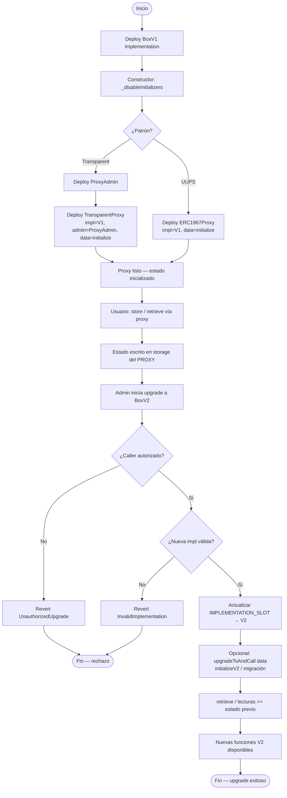
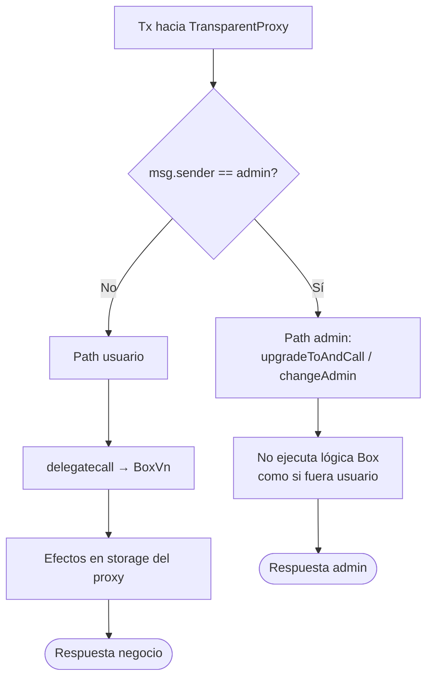
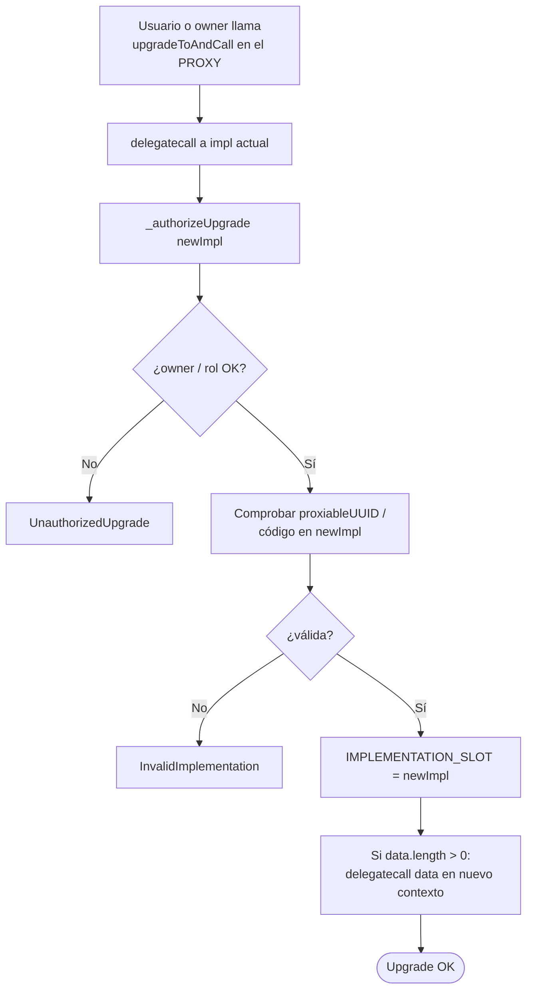
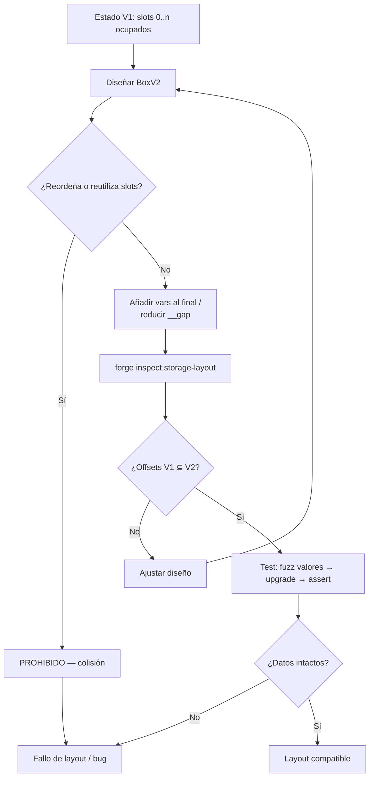
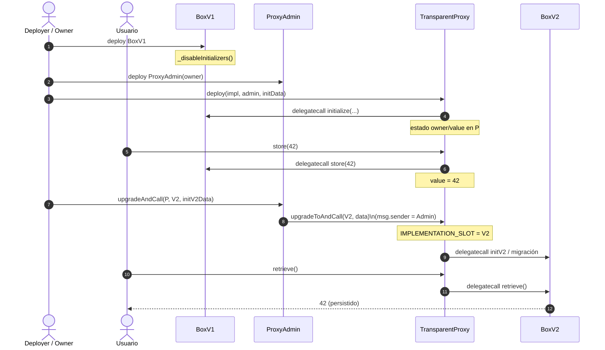
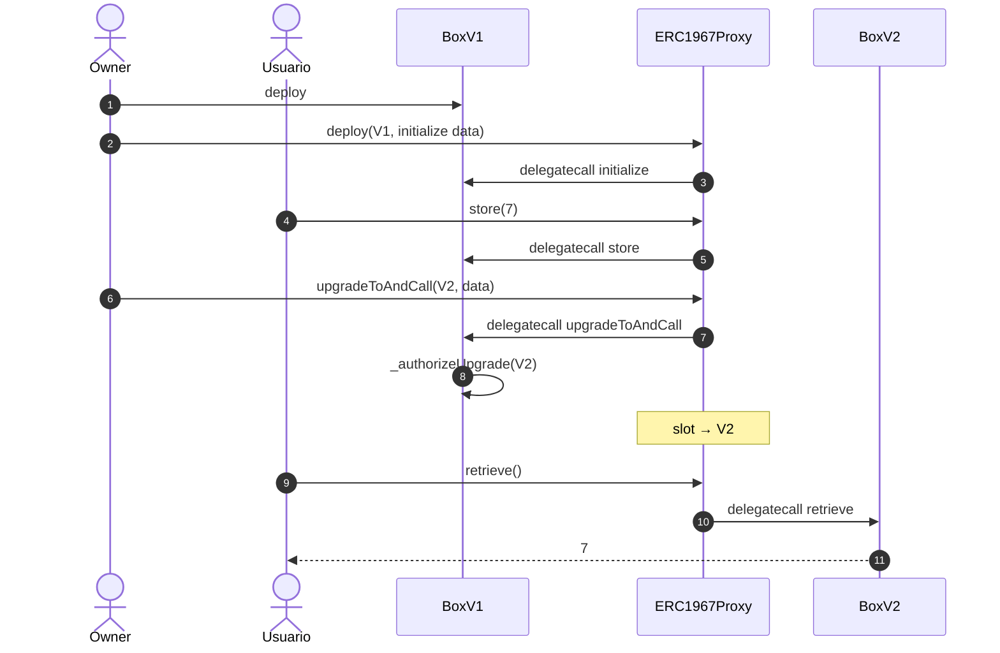

# Flujograma — Ciclo completo de proxies upgradeables

Flujo extremo a extremo entre actores y contratos: despliegue, uso, upgrade y verificación de persistencia.

## Actores

| Actor | Rol |
|-------|-----|
| Deployer | Despliega impl, proxy y (si aplica) `ProxyAdmin` |
| Owner / Admin | Autoriza upgrades (`ProxyAdmin.owner` o `_authorizeUpgrade`) |
| Usuario | Llama funciones de negocio a través del proxy |
| Proxy | Guarda slots EIP-1967; enruta con `delegatecall` |
| Implementation V1 / V2 | Lógica; storage layout compatible |
| Tester / CI | Foundry: unit, unauthorized, fuzz, `forge inspect` |

---

## Flujograma principal — Deploy → Use → Upgrade → Verify

---

## Flujograma Transparent — admin vs usuario

---

## Flujograma UUPS — autorización en la lógica

---

## Flujograma anti corrupción de storage

---

## Secuencia — Transparent (ejemplo)

---

## Secuencia — UUPS (ejemplo)

---

## Resumen operativo

1. **Deploy de la impl** siempre con inicializadores deshabilitados en constructor.
2. **Initialize solo vía proxy** (calldata del constructor del proxy o llamada posterior controlada).
3. **Usuario habla con el proxy**, nunca necesita conocer la dirección de la impl (salvo operación/ops).
4. **Upgrade = cambiar un slot EIP-1967** (+ autorización); el storage de negocio permanece.
5. **Tests Foundry** deben recorrer este flujograma y los caminos `UnauthorizedUpgrade`, `AlreadyInitialized`, `InvalidImplementation`, `DelegateCallFailed`.
